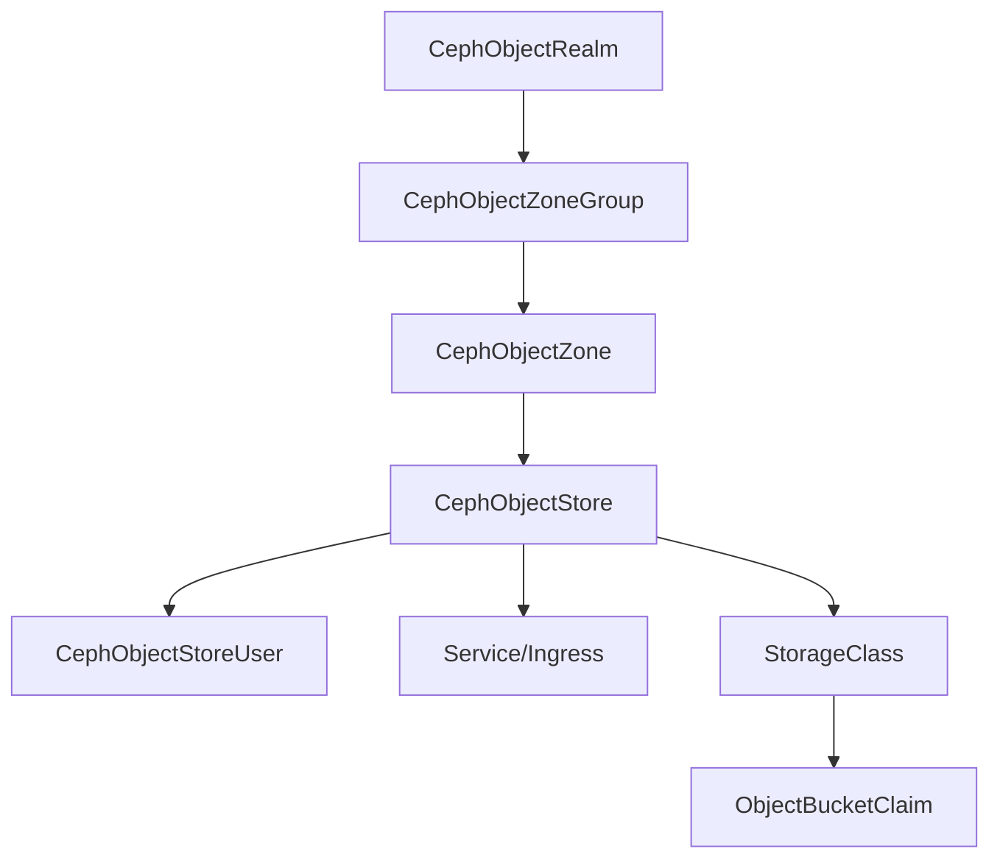

# Rook Ceph Object Gateway CRDs Documentation

This documentation provides comprehensive information about the Rook Ceph Operator's object gateway functionality, including all Custom Resource Definitions (CRDs) and their usage patterns.

## Table of Contents

1. [Core CRDs for Object Gateway](#core-crds-for-object-gateway)
2. [Configuration Examples](#configuration-examples)
3. [Integration Patterns](#integration-patterns)
4. [Operational Considerations](#operational-considerations)

## Core CRDs for Object Gateway

### 1. CephObjectStore CRD

The CephObjectStore CRD defines an object storage service in the Ceph cluster that exposes S3 and/or Swift APIs.

#### Required Fields

```yaml
apiVersion: ceph.rook.io/v1
kind: CephObjectStore
metadata:
  name: my-store
  namespace: rook-ceph
spec:
  # Gateway configuration is required
  gateway:
    port: 80
    instances: 1
```

#### Complete Configuration Example

```yaml
apiVersion: ceph.rook.io/v1
kind: CephObjectStore
metadata:
  name: my-store
  namespace: rook-ceph
spec:
  # Metadata pool (must use replication)
  metadataPool:
    failureDomain: host
    replicated:
      size: 3
      requireSafeReplicaSize: true
    parameters:
      compression_mode: none
  
  # Data pool (can use replication or erasure coding)
  dataPool:
    failureDomain: host
    # Option 1: Replicated
    replicated:
      size: 3
      requireSafeReplicaSize: true
    # Option 2: Erasure Coded
    # erasureCoded:
    #   dataChunks: 2
    #   codingChunks: 1
    parameters:
      bulk: "true"
      compression_mode: none
  
  # Preserve pools when deleting the object store
  preservePoolsOnDelete: false
  
  # Gateway settings
  gateway:
    # TLS configuration
    # sslCertificateRef: tls-secret-name
    # caBundleRef: ca-bundle-secret
    port: 80
    # securePort: 443
    instances: 1
    
    # Resource limits
    resources:
      limits:
        memory: "2Gi"
        cpu: "2"
      requests:
        memory: "1Gi"
        cpu: "1"
    
    # Pod placement
    placement:
      nodeAffinity:
        requiredDuringSchedulingIgnoredDuringExecution:
          nodeSelectorTerms:
          - matchExpressions:
            - key: role
              operator: In
              values:
              - rgw-node
    
    # Additional volume mounts
    additionalVolumeMounts:
      - subPath: config
        volumeSource:
          configMap:
            name: rgw-config
    
    # Priority class
    priorityClassName: system-cluster-critical
    
    # Service annotations (useful for OpenShift)
    service:
      annotations:
        service.beta.openshift.io/serving-cert-secret-name: rgw-cert
  
  # Zone configuration (for multisite)
  # zone:
  #   name: zone-a
  
  # Health check configuration
  healthCheck:
    startupProbe:
      disabled: false
    readinessProbe:
      disabled: false
      periodSeconds: 5
      failureThreshold: 2
  
  # Virtual hosting configuration
  hosting:
    advertiseEndpoint:
      dnsName: s3.example.com
      port: 443
      useTls: true
    dnsNames:
      - s3.example.com
      - "*.s3.example.com"
  
  # Protocol configuration
  protocols:
    enableAPIs:
      - s3
      - s3website
      - swift
      - swift_auth
      - admin
      - sts
      - iam
      - notifications
    s3:
      enabled: true
      authUseKeystone: false
    swift:
      accountInUrl: true
      urlPrefix: swift
      versioningEnabled: true
  
  # Authentication configuration
  auth:
    keystone:
      url: https://keystone.example.com:5000
      acceptedRoles:
        - admin
        - member
      implicitTenants: swift
      tokenCacheSize: 1000
      serviceUserSecretName: keystone-admin
  
  # Security settings (KMS)
  security:
    kms:
      connectionDetails:
        KMS_PROVIDER: vault
        VAULT_ADDR: http://vault.default.svc:8200
        VAULT_BACKEND_PATH: rgw
        VAULT_SECRET_ENGINE: kv
        VAULT_BACKEND: v2
      tokenSecretName: rgw-vault-token
    s3:
      connectionDetails:
        KMS_PROVIDER: vault
        VAULT_ADDR: http://vault.default.svc:8200
        VAULT_BACKEND_PATH: rgw
        VAULT_SECRET_ENGINE: transit
      tokenSecretName: rgw-vault-token
  
  # Allow users in other namespaces
  allowUsersInNamespaces:
    - app-namespace
    - "*"  # Allow all namespaces
  
  # Default realm marker
  defaultRealm: false
```

### 2. CephObjectStoreUser CRD

Manages S3/Swift users for accessing the object store.

```yaml
apiVersion: ceph.rook.io/v1
kind: CephObjectStoreUser
metadata:
  name: my-user
  namespace: rook-ceph
spec:
  # Reference to the object store
  store: my-store
  
  # Display name for the user
  displayName: "My Display Name"
  
  # User can be created in different namespace if allowed
  # clusterNamespace: rook-ceph
  
  # Quotas
  quotas:
    maxBuckets: 100
    maxSize: 10G
    maxObjects: 10000
  
  # Capabilities (admin permissions)
  capabilities:
    user: "*"
    bucket: "*"
    usage: "read"
    metadata: "read, write"
    zone: "read"
    info: "read"
  
  # Explicit key management
  # keys:
  #   - accessKeyRef:
  #       name: user-s3-keys
  #       key: AWS_ACCESS_KEY_ID
  #     secretKeyRef:
  #       name: user-s3-keys
  #       key: AWS_SECRET_ACCESS_KEY
```

### 3. CephObjectRealm CRD

Defines a realm for multisite replication.

```yaml
apiVersion: ceph.rook.io/v1
kind: CephObjectRealm
metadata:
  name: realm-a
  namespace: rook-ceph
spec:
  # Mark as default realm
  defaultRealm: false
  
  # Pull configuration for syncing from another cluster
  pull:
    # Endpoint from master zone in master zone group
    endpoint: http://10.2.105.133:80
```

### 4. CephObjectZoneGroup CRD

Groups zones within a realm for multisite.

```yaml
apiVersion: ceph.rook.io/v1
kind: CephObjectZoneGroup
metadata:
  name: zonegroup-a
  namespace: rook-ceph
spec:
  # Reference to the realm
  realm: realm-a
```

### 5. CephObjectZone CRD

Defines a zone within a zone group for multisite.

```yaml
apiVersion: ceph.rook.io/v1
kind: CephObjectZone
metadata:
  name: zone-a
  namespace: rook-ceph
spec:
  # Reference to zone group
  zoneGroup: zonegroup-a
  
  # Metadata pool configuration
  metadataPool:
    failureDomain: host
    replicated:
      size: 3
      requireSafeReplicaSize: true
  
  # Data pool configuration
  dataPool:
    failureDomain: host
    erasureCoded:
      dataChunks: 2
      codingChunks: 1
    parameters:
      bulk: "true"
  
  # Custom endpoints for multisite replication
  customEndpoints:
    - "http://rgw-a.example.com"
    - "https://rgw-b.example.com:443"
  
  # Preserve pools on deletion
  preservePoolsOnDelete: true
```

### 6. ObjectBucketClaim (OBC)

Standard Kubernetes resource for requesting S3 buckets.

```yaml
apiVersion: objectbucket.io/v1alpha1
kind: ObjectBucketClaim
metadata:
  name: ceph-bucket
  namespace: default
spec:
  # Generate a unique bucket name
  generateBucketName: ceph-bkt
  
  # Or specify exact bucket name
  # bucketName: my-specific-bucket
  
  # Reference to storage class
  storageClassName: rook-ceph-bucket
  
  # Additional configuration
  additionalConfig:
    maxObjects: "10000"
    maxSize: "100Gi"
```

## Configuration Examples

### Basic Object Store Setup

Simple single-zone object store with replication:

```yaml
---
apiVersion: ceph.rook.io/v1
kind: CephObjectStore
metadata:
  name: simple-store
  namespace: rook-ceph
spec:
  metadataPool:
    failureDomain: host
    replicated:
      size: 3
  dataPool:
    failureDomain: host
    replicated:
      size: 3
  gateway:
    port: 80
    instances: 3
    placement:
      podAntiAffinity:
        preferredDuringSchedulingIgnoredDuringExecution:
        - weight: 100
          podAffinityTerm:
            labelSelector:
              matchExpressions:
              - key: app
                operator: In
                values:
                - rook-ceph-rgw
            topologyKey: kubernetes.io/hostname
```

### Erasure Coded Storage

Object store with erasure coding for efficient storage:

```yaml
apiVersion: ceph.rook.io/v1
kind: CephObjectStore
metadata:
  name: ec-store
  namespace: rook-ceph
spec:
  metadataPool:
    failureDomain: host
    replicated:
      size: 3
  dataPool:
    failureDomain: host
    erasureCoded:
      dataChunks: 4
      codingChunks: 2
    parameters:
      bulk: "true"
  gateway:
    port: 80
    instances: 2
```

### Multi-Zone Configuration

Complete multisite setup with primary zone:

```yaml
---
# Realm
apiVersion: ceph.rook.io/v1
kind: CephObjectRealm
metadata:
  name: global-realm
  namespace: rook-ceph
---
# Zone Group
apiVersion: ceph.rook.io/v1
kind: CephObjectZoneGroup
metadata:
  name: us-zonegroup
  namespace: rook-ceph
spec:
  realm: global-realm
---
# Primary Zone
apiVersion: ceph.rook.io/v1
kind: CephObjectZone
metadata:
  name: us-east-1
  namespace: rook-ceph
spec:
  zoneGroup: us-zonegroup
  metadataPool:
    failureDomain: host
    replicated:
      size: 3
  dataPool:
    failureDomain: host
    replicated:
      size: 3
    parameters:
      bulk: "true"
  customEndpoints:
    - "https://s3-us-east-1.example.com"
---
# Object Store in Zone
apiVersion: ceph.rook.io/v1
kind: CephObjectStore
metadata:
  name: us-east-store
  namespace: rook-ceph
spec:
  gateway:
    port: 80
    securePort: 443
    sslCertificateRef: rgw-tls-cert
    instances: 3
  zone:
    name: us-east-1
```

### Secondary Zone for Replication

Setup for pulling realm from primary cluster:

```yaml
---
# Secret with realm keys from primary
apiVersion: v1
kind: Secret
metadata:
  name: global-realm-keys
  namespace: rook-ceph
type: kubernetes.io/rook
data:
  access-key: <base64-encoded-access-key>
  secret-key: <base64-encoded-secret-key>
---
# Pull realm from primary
apiVersion: ceph.rook.io/v1
kind: CephObjectRealm
metadata:
  name: global-realm
  namespace: rook-ceph
spec:
  pull:
    endpoint: https://s3-us-east-1.example.com
---
# Zone group (same as primary)
apiVersion: ceph.rook.io/v1
kind: CephObjectZoneGroup
metadata:
  name: us-zonegroup
  namespace: rook-ceph
spec:
  realm: global-realm
---
# Secondary zone
apiVersion: ceph.rook.io/v1
kind: CephObjectZone
metadata:
  name: us-west-1
  namespace: rook-ceph
spec:
  zoneGroup: us-zonegroup
  metadataPool:
    failureDomain: host
    replicated:
      size: 3
  dataPool:
    failureDomain: host
    replicated:
      size: 3
  customEndpoints:
    - "https://s3-us-west-1.example.com"
---
# Secondary object store
apiVersion: ceph.rook.io/v1
kind: CephObjectStore
metadata:
  name: us-west-store
  namespace: rook-ceph
spec:
  gateway:
    port: 80
    securePort: 443
    sslCertificateRef: rgw-tls-cert
    instances: 3
  zone:
    name: us-west-1
```

### User Creation and Access Management

```yaml
---
# S3 User with quotas
apiVersion: ceph.rook.io/v1
kind: CephObjectStoreUser
metadata:
  name: app-user
  namespace: rook-ceph
spec:
  store: my-store
  displayName: "Application User"
  quotas:
    maxBuckets: 10
    maxSize: 100G
    maxObjects: 100000
---
# Admin user with full capabilities
apiVersion: ceph.rook.io/v1
kind: CephObjectStoreUser
metadata:
  name: admin-user
  namespace: rook-ceph
spec:
  store: my-store
  displayName: "Admin User"
  capabilities:
    user: "*"
    bucket: "*"
    metadata: "*"
    usage: "*"
    zone: "*"
```

### Storage Class Integration

```yaml
---
# Storage class for bucket provisioning
apiVersion: storage.k8s.io/v1
kind: StorageClass
metadata:
  name: rook-ceph-bucket
provisioner: rook-ceph.ceph.rook.io/bucket
reclaimPolicy: Delete
parameters:
  objectStoreName: my-store
  objectStoreNamespace: rook-ceph
  # Optional: specify region for multisite
  # region: us-east-1
---
# Storage class with retention
apiVersion: storage.k8s.io/v1
kind: StorageClass
metadata:
  name: rook-ceph-bucket-retain
provisioner: rook-ceph.ceph.rook.io/bucket
reclaimPolicy: Retain
parameters:
  objectStoreName: my-store
  objectStoreNamespace: rook-ceph
```

### Ingress/Service Exposure

```yaml
---
# NodePort service for external access
apiVersion: v1
kind: Service
metadata:
  name: rgw-external
  namespace: rook-ceph
spec:
  type: NodePort
  ports:
  - name: http
    port: 80
    targetPort: 80
    nodePort: 30080
  - name: https
    port: 443
    targetPort: 443
    nodePort: 30443
  selector:
    app: rook-ceph-rgw
    rook_object_store: my-store
---
# Ingress for HTTP/HTTPS access
apiVersion: networking.k8s.io/v1
kind: Ingress
metadata:
  name: rgw-ingress
  namespace: rook-ceph
  annotations:
    nginx.ingress.kubernetes.io/proxy-body-size: "0"
    nginx.ingress.kubernetes.io/proxy-read-timeout: "600"
    nginx.ingress.kubernetes.io/proxy-send-timeout: "600"
spec:
  tls:
  - hosts:
    - s3.example.com
    - "*.s3.example.com"
    secretName: rgw-tls-cert
  rules:
  - host: s3.example.com
    http:
      paths:
      - path: /
        pathType: Prefix
        backend:
          service:
            name: rook-ceph-rgw-my-store
            port:
              number: 80
  - host: "*.s3.example.com"
    http:
      paths:
      - path: /
        pathType: Prefix
        backend:
          service:
            name: rook-ceph-rgw-my-store
            port:
              number: 80
```

### Shared Pools Configuration

Multiple stores sharing the same pools:

```yaml
---
# Shared pools
apiVersion: ceph.rook.io/v1
kind: CephBlockPool
metadata:
  name: rgw-meta-pool
  namespace: rook-ceph
spec:
  failureDomain: host
  replicated:
    size: 3
  parameters:
    pg_num: "32"
  application: rgw
---
apiVersion: ceph.rook.io/v1
kind: CephBlockPool
metadata:
  name: rgw-data-pool
  namespace: rook-ceph
spec:
  failureDomain: host
  erasureCoded:
    dataChunks: 4
    codingChunks: 2
  parameters:
    bulk: "true"
  application: rgw
---
# Store A using shared pools
apiVersion: ceph.rook.io/v1
kind: CephObjectStore
metadata:
  name: store-a
  namespace: rook-ceph
spec:
  sharedPools:
    metadataPoolName: rgw-meta-pool
    dataPoolName: rgw-data-pool
    preserveRadosNamespaceDataOnDelete: true
  gateway:
    port: 80
    instances: 2
---
# Store B using same shared pools
apiVersion: ceph.rook.io/v1
kind: CephObjectStore
metadata:
  name: store-b
  namespace: rook-ceph
spec:
  sharedPools:
    metadataPoolName: rgw-meta-pool
    dataPoolName: rgw-data-pool
    preserveRadosNamespaceDataOnDelete: true
  gateway:
    port: 80
    instances: 2
```

### Pool Placement Configuration

Advanced pool placement with storage classes:

```yaml
apiVersion: ceph.rook.io/v1
kind: CephObjectStore
metadata:
  name: placement-store
  namespace: rook-ceph
spec:
  gateway:
    port: 80
    instances: 2
  sharedPools:
    poolPlacements:
    - name: hot-storage
      default: true
      metadataPoolName: "hot-meta-pool"
      dataPoolName: "hot-data-pool"
      dataNonECPoolName: "hot-index-pool"
      storageClasses:
      - name: STANDARD
        dataPoolName: "hot-data-pool"
      - name: REDUCED_REDUNDANCY
        dataPoolName: "warm-data-pool"
    - name: cold-storage
      metadataPoolName: "cold-meta-pool"
      dataPoolName: "cold-data-pool"
      storageClasses:
      - name: GLACIER
        dataPoolName: "archive-data-pool"
```

## Integration Patterns

### Deployment Sequence

The proper order for deploying multisite object storage:

1. **Primary Cluster Setup**
   ```bash
   # 1. Create realm
   kubectl apply -f realm.yaml
   
   # 2. Create zone group
   kubectl apply -f zonegroup.yaml
   
   # 3. Create zone with pools
   kubectl apply -f zone.yaml
   
   # 4. Create object store
   kubectl apply -f objectstore.yaml
   
   # 5. Wait for RGW pods
   kubectl wait --for=condition=ready pod -l app=rook-ceph-rgw -n rook-ceph
   
   # 6. Create users if needed
   kubectl apply -f users.yaml
   ```

2. **Secondary Cluster Setup**
   ```bash
   # 1. Get realm keys from primary
   kubectl get secret realm-a-keys -n rook-ceph -o yaml > realm-keys.yaml
   
   # 2. Apply keys to secondary cluster
   kubectl apply -f realm-keys.yaml
   
   # 3. Create realm with pull config
   kubectl apply -f realm-pull.yaml
   
   # 4. Create zone group (same name as primary)
   kubectl apply -f zonegroup.yaml
   
   # 5. Create secondary zone
   kubectl apply -f zone-secondary.yaml
   
   # 6. Create object store for secondary zone
   kubectl apply -f objectstore-secondary.yaml
   ```

### Dependencies Between CRDs



### Common Deployment Patterns

#### 1. Single-Site Object Store
- Simple CephObjectStore without zone configuration
- Pools created automatically
- Suitable for single-cluster deployments

#### 2. Multi-Site Primary-Secondary
- Primary zone in one cluster
- Secondary zones pulling from primary
- Asynchronous replication between zones

#### 3. Multi-Site Active-Active
- Multiple zones with bidirectional sync
- Load balancing across zones
- Requires careful endpoint configuration

#### 4. Multi-Instance with Shared Pools
- Multiple object stores sharing backend pools
- Different configurations per store
- Efficient resource utilization

### Scaling Patterns

#### Gateway Scaling for Multisite

```yaml
---
# Dedicated sync gateway (single instance)
apiVersion: ceph.rook.io/v1
kind: CephObjectStore
metadata:
  name: sync-gateway
  namespace: rook-ceph
spec:
  gateway:
    port: 80
    instances: 1
    disableMultisiteSyncTraffic: false
  zone:
    name: zone-a
---
# Client-serving gateways (multiple instances)
apiVersion: ceph.rook.io/v1
kind: CephObjectStore
metadata:
  name: client-gateways
  namespace: rook-ceph
spec:
  gateway:
    port: 80
    instances: 5
    disableMultisiteSyncTraffic: true
    resources:
      requests:
        cpu: "2"
        memory: "4Gi"
      limits:
        cpu: "4"
        memory: "8Gi"
  zone:
    name: zone-a
```

## Operational Considerations

### Monitoring and Observability

#### Health Monitoring
```yaml
# Object store with health checks
spec:
  healthCheck:
    startupProbe:
      disabled: false
      initialDelaySeconds: 10
      periodSeconds: 10
      failureThreshold: 30
    readinessProbe:
      disabled: false
      periodSeconds: 5
      failureThreshold: 2
    livenessProbe:
      disabled: false
      periodSeconds: 10
      failureThreshold: 3
```

#### Metrics Collection
- RGW exposes Prometheus metrics on port 9283
- Monitor via ServiceMonitor CRD
- Key metrics: request rates, latency, bandwidth, errors

#### Logging Configuration
```yaml
# Enable ops log sidecar for detailed logging
spec:
  gateway:
    opsLogSidecar:
      resources:
        requests:
          cpu: "100m"
          memory: "100Mi"
        limits:
          cpu: "500m"
          memory: "500Mi"
```

### Backup and Disaster Recovery

#### Data Protection Strategies

1. **Multisite Replication**
   - Automatic replication between zones
   - RPO depends on sync interval
   - Built-in failover capabilities

2. **Pool Snapshots**
   - Manual snapshots via Ceph commands
   - Point-in-time recovery
   - Requires toolbox access

3. **Bucket Versioning**
   - Enable via bucket policy
   - Protects against accidental deletion
   - Increases storage usage

#### Backup Procedures

```bash
# Export user and bucket metadata
kubectl exec -it deploy/rook-ceph-tools -n rook-ceph -- \
  radosgw-admin metadata list

# Backup specific bucket
kubectl exec -it deploy/rook-ceph-tools -n rook-ceph -- \
  radosgw-admin bucket stats --bucket=my-bucket > bucket-backup.json
```

### Scaling Considerations

#### Horizontal Scaling

1. **Gateway Instances**
   - Increase `instances` for more throughput
   - Use anti-affinity for distribution
   - Consider separate sync/client gateways

2. **Pool Scaling**
   - Adjust PG numbers for pool performance
   - Monitor PG per OSD ratio
   - Use `bulk: true` for large data pools

#### Vertical Scaling

```yaml
# Resource allocation for heavy workloads
spec:
  gateway:
    resources:
      requests:
        cpu: "4"
        memory: "16Gi"
      limits:
        cpu: "8"
        memory: "32Gi"
```

### Common Troubleshooting

#### Debugging Failed Deployments

```bash
# Check RGW pod status
kubectl get pods -n rook-ceph -l app=rook-ceph-rgw

# View RGW logs
kubectl logs -n rook-ceph deployment/rook-ceph-rgw-my-store-a

# Check realm/zone status via toolbox
kubectl exec -it deploy/rook-ceph-tools -n rook-ceph -- \
  radosgw-admin realm list

# Verify zone configuration
kubectl exec -it deploy/rook-ceph-tools -n rook-ceph -- \
  radosgw-admin zone get
```

#### Common Issues and Solutions

1. **Multisite Sync Issues**
   - Check network connectivity between zones
   - Verify realm keys are correct
   - Ensure endpoints are accessible
   - Check sync status: `radosgw-admin sync status`

2. **Authentication Failures**
   - Verify user credentials in secrets
   - Check capabilities for admin operations
   - Ensure proper namespace permissions

3. **Performance Problems**
   - Monitor PG distribution
   - Check OSD utilization
   - Review gateway resource allocation
   - Enable caching if needed

4. **Certificate Issues**
   - Verify certificate includes all required SANs
   - Check certificate validity
   - Ensure CA bundle is complete
   - Test with `insecureSkipVerify` for debugging

### Maintenance Operations

#### Updating Object Store Configuration

```bash
# Apply configuration changes
kubectl apply -f objectstore.yaml

# RGW pods will restart automatically
kubectl rollout status deployment/rook-ceph-rgw-my-store-a -n rook-ceph
```

#### Zone Removal (Multisite)

```bash
# Remove zone from zone group
kubectl exec -it deploy/rook-ceph-tools -n rook-ceph -- \
  radosgw-admin zonegroup rm \
    --rgw-zonegroup=zonegroup-a \
    --rgw-zone=zone-b

# Update period
kubectl exec -it deploy/rook-ceph-tools -n rook-ceph -- \
  radosgw-admin period update --commit

# Delete zone
kubectl exec -it deploy/rook-ceph-tools -n rook-ceph -- \
  radosgw-admin zone delete \
    --rgw-zone=zone-b

# Remove CRDs
kubectl delete cephobjectstore zone-b-store -n rook-ceph
kubectl delete cephobjectzone zone-b -n rook-ceph
```

#### Clean Shutdown

```bash
# 1. Stop accepting new requests
kubectl scale deployment rook-ceph-rgw-my-store-a --replicas=0 -n rook-ceph

# 2. Wait for sync to complete (multisite)
kubectl exec -it deploy/rook-ceph-tools -n rook-ceph -- \
  radosgw-admin sync status

# 3. Delete object store (preserving pools if needed)
kubectl delete cephobjectstore my-store -n rook-ceph

# 4. Optionally remove pools
kubectl exec -it deploy/rook-ceph-tools -n rook-ceph -- \
  ceph osd pool delete my-store.rgw.buckets.data \
    my-store.rgw.buckets.data --yes-i-really-really-mean-it
```

## Best Practices

### Production Recommendations

1. **High Availability**
   - Minimum 3 RGW instances for production
   - Use anti-affinity rules
   - Configure health checks appropriately
   - Set up monitoring and alerting

2. **Security**
   - Always use TLS in production
   - Implement proper network policies
   - Use strong bucket policies
   - Regular key rotation
   - Enable audit logging

3. **Performance**
   - Use erasure coding for large datasets
   - Configure appropriate PG numbers
   - Tune gateway resources based on workload
   - Consider SSD pools for metadata

4. **Multisite**
   - Plan network topology carefully
   - Use dedicated sync gateways
   - Monitor replication lag
   - Test failover procedures

5. **Resource Management**
   - Set appropriate quotas
   - Monitor pool usage
   - Plan for growth
   - Regular capacity reviews

### Migration Strategies

#### Migrating Existing Object Store to Multisite

1. Backup existing data and metadata
2. Create multisite CRDs matching existing names
3. Update object store to reference zone
4. Verify functionality
5. Set up secondary zones

#### Upgrading RGW Configuration

1. Test changes in non-production
2. Plan maintenance window
3. Update CRDs incrementally
4. Monitor during rollout
5. Have rollback plan ready

## Additional Resources

- [Rook Object Storage Documentation](https://rook.io/docs/rook/latest/Storage-Configuration/Object-Storage-RGW/object-storage/)
- [Ceph RGW Documentation](https://docs.ceph.com/en/latest/radosgw/)
- [Rook GitHub Examples](https://github.com/rook/rook/tree/master/deploy/examples)
- [Ceph Multisite Guide](https://docs.ceph.com/en/latest/radosgw/multisite/)
- [S3 API Compatibility](https://docs.ceph.com/en/latest/radosgw/s3/)